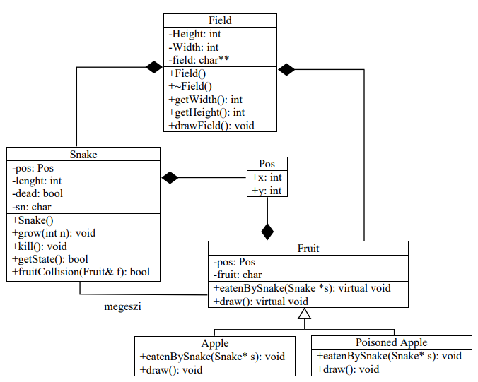
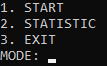
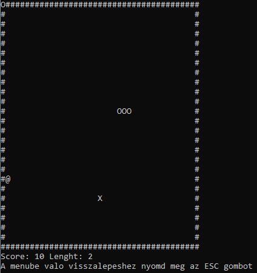
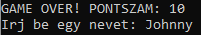
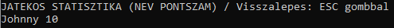

# Kígyó játék konzolos megjelenítéssel

Egyetemi projektem egyike, így a kód tartalmazhat látszólag felesleges részeket (pl feltételes fordítások).

## Feladat

- A jól megszokott klasszikus kígyó játék konzolos megjelenítéssel. A cél, hogy a játékos a kígyót irányítva minél több pontot szerezzen, megelőzve játékos társait a ranglistán.

### Játékszabályok

- A játékos irányítja a kígyót. A kígyó, a gyümölcsök megevésével 
folyamatosan növekszik, ezáltal pontot szerez. Ez így folytatódik mindaddig, amíg a játékos 
falnak, vagy saját magának nem ütközik, vagy éppen nem evett meg egy mérgező gyümölcsöt. Game over esetén a standard inputra a játékos 
a saját nevét beírva (karaktersor) mentheti el a játékállást, a megszerzett pontszámmal együtt
(egész szám).

### Bemenetek/Kimenetek

- Az alap bemenetekhez a nyíl gombok tartoznak, melyekkel a kígyót 
tudjuk irányítani. Egyéb bemenet és egyben kimenet is, a játékállás tárolásához szükséges txt 
fájl, melybe kiírásra kerülnek az adatok, a program bezárásakor, illetve a program futtatásakor 
ebből a fájlból kerülnek beolvasásra és eltárolásra is, dinamikus memóriába (az aktuális 
játékállás megjelenítéséhez szükséges), melynek mérete növekedhet, attól függően, hogy hány 
játékos játszott a program futása alatt.

### Objektumok

- Mind a pálya, a kígyó és a gyümölcsök is külön objektumként vannak
megvalósítva, amelyekhez a későbbiekben akár fel lehet venni újakat is (pl. újfajta gyümölcs). 

- A jelenlegi programban 1 mérgező gyümölcs (X) és 1 nem mérgező gyümölcs (@) található. A mérgező gyümölcs bizonyos időközönként random váltogatja a helyzetét.

### Nézetek

- A kiinduló helyzet a start állás. A kiinduló nézet és az egyéb nézetek (játék, játékos 
állás) között parancssorokkal (adott gomb lenyomásával) tudunk navigálni.

### Futás eredménye

- Futás eredménye: A képernyőn megjelenik a start felirat, ahol egy gomb lenyomásának 
hatására a játék elindul. Játék vége esetén megjelenik a game over, majd itt beírhatjuk a 
nevünket a konzolra és elmenthetjük a játékállást. Az elmentett neveket a pontszámmal együtt, 
külön lekérdezhetjük a konzolról.

## Objektum terv

### Pozíció (Pos)

- A Pos objektum az, amely része mind a kígyó, mind pedig a Fruit objektumnak, 
hiszen mind a kettőnek saját pozíciója van a mezőn. Emellett szükséges a pozíció segítségével 
a különböző ütközéseket is vizsgálni. 2 adattagja van, egy x és egy y koordináta.

### Kígyó (Snake)

- A kígyó objektum alap konstruktora beállítja a kígyó kezdő pozícióját a 
játékmezőn, illetve a kezdeti hosszát és a karaktert, amellyel meg lesz jelenítve. A grow 
függvény növeli a kígyó hosszát, ha a kígyó megevett egy gyümölcsöt. Gyümölcsből többfélét 
megehet. A kill tagfüggvény a dead értéket igazra állítja, melyet a getState pedig visszaad 
(game over esetén szükséges). A kígyó a mező része lesz, és az aktuális mező indexeinek
(pozíció) megváltoztatásával tud majd mozogni.

### Gyümölcs (Fruit)

- A gyümölcs osztályhoz szükséges adattagok a mezőn lévő pozíciója,
illetve, hogy milyen karakterrel lesz megjelenítve. Alapból két leszármazottja van, melyek 
különböző gyümölcsfajtákat jellemeznek. A Fruit osztályhoz a későbbiekben akár új 
gyümölcsöket is be lehet venni. Szintén a mező része.

### Alma/mérgezett alma (Apple/PoisonedApple)

- A gyümölcs osztály leszármazottjai. Mind a 
kettő különböző funkcióval bír. A sima alma elfogyasztása miatt a kígyó növekszik egyel, míg 
a mérgezett alma hatására meghal és game over történik.

### Pálya (Field)

- A pálya egy két dimenziós dinamikus 
tömbbe kerül eltárolásra, amit egy txt fájlból (field.txt) olvas be a program és ennek a határait 
’#’ szimbólum jelöli.

### Objektumok kapcsolata az alábbi diagramon (a diagram a tervezés fázisában lett elkészítve, így nem reprezentálja a végleges kódba bekerült objektumokat teljesen)

### Kiinduló nézet

### Játék nézet

### Game over

### Ranglista
